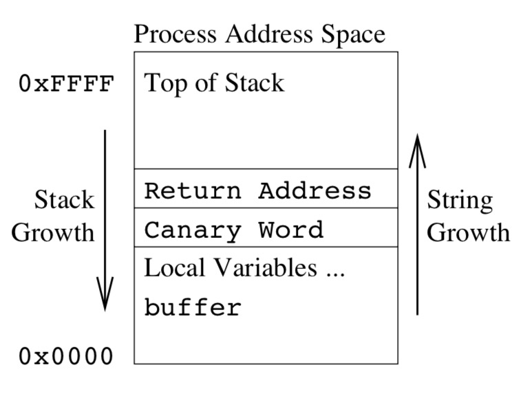
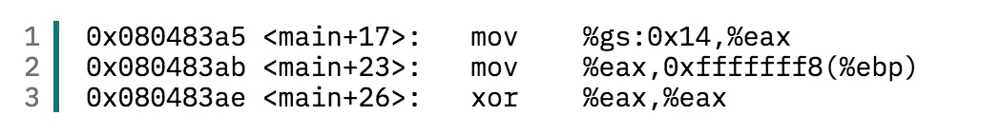
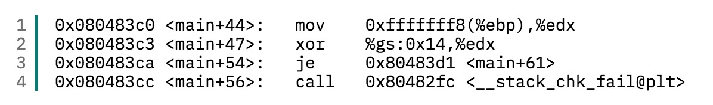

### Control-Flow Integrity                 
---                
#### 0x00. 从跳转指令开始谈起               
在汇编语言中,根据寻址方式的不同可以分为两种跳转指令。一种是间接跳转指令,另一种是直接跳转指令。        
直接跳转指令的示例如下所示:   

> CALL 0x1060000F      

在程序执行到这条语句时,就会将指令寄存器的值替换为0x1060000F。这种在指令中直接给出跳转地址的寻址方式就叫做直接转移。在高级语言中, 像if-else,静态函数调用这种跳转目标往往可以确定的语句就会被转换为直接跳转指令。                  
                     
间接跳转指令则是使用数据寻址方式间接的指出转移地址，比如:               
> JMP EBX            

执行完这条指令之后, 指令寄存器的值就被替换为EBX寄存器的值。它的转换对象为作为回调参数的函数指针等动态决定目标地址的语句。       
                  
以上是通过寻址方式进行的分类, 在CFI中还有一个比较特殊的分类方式, 就是前向和后向转移。        
这个比较容易理解, 将控制权定向到程序中一个新位置的转移方式, 就叫做前向转移, 比如jmp和call指令             
而将控制权返回到先前位置的就叫做后向转移, 最常见的就是ret指令。        
                  
将以上两种分类方式结合起来, 前向转移指令call和jmp根据寻址方式不同, 又可以分为直接jmp, 间接jmp，直接call，间接call四种。而后向转移指令ret没有操作数，它的目标地址计算是通过从栈中弹出的数来决定的。正因为ret指令的特性，引发了一系列针对返回地址的攻击。

#### 0x01. CFI发展历史和提出原因         
**由于老师给的参考文献较多,且属于几个不同方向的,因此想用时间线的方式讲清楚CFI的发展历史以及不同CFI机制的原理等等(这里只涉及了文献以及文献中提到的主要技术)**         
      
* 20世纪80年代  出现溢出攻击    
在20世纪80年代,就已经出现了溢出攻击。在1988年的Morris蠕虫利用了Unix上的finger服务的缓冲区溢出漏洞之后,溢出攻击被更多人知晓并研究。     

* 1996年  第一篇具有学术价值的缓冲区溢出论文       
在针对这类漏洞的利用逐渐增多之后。1996年,Aleph One在Phrack杂志上发表了题为“Smashing the Stack for Fun and Profit”的文章,并详细描述了Linux系统中栈的结构和如何利用基于栈的缓冲区溢出。           

* 1998年 StackGuard的出现(StackGuard **第5篇文章**)        
1998年,Cowan,C.Pu等人在USENIX上提出了侦测和防止缓冲区溢出发生的自适应技术,即StackGuard。StackGuard是第一个使用 Canary探测的堆栈保护实现，它于1997年作为GCC的一个扩展发布。     
**StackGuard**的简要介绍:      
StackGuard是一个编译器扩展,用于检测并阻止对堆栈的缓冲区溢出攻击。它有两种工作模式,一种是在函数返回之前检测返回地址的变化(Canary),另一种是完全拒绝写入返回地址来阻止动态修改(MemGuard)。      
**第一种方法**是,在栈中的返回地址旁放置一个"Canary"值,在函数返回之前检测Canary是否一致再跳转。栈结构如下图所示:

  

下面用两段汇编代码说明Canary保护的具体操作,第一段代码是在函数执行前多出的三条语句, %gs:0x14中存储的是一个随机数,在执行前把这个随机数赋给EAX,然后将EAX压入EBP-8的位置。第二段代码是在函数返回前的操作,将该随机数弹栈,并与原来的数异或比较,如果相同才跳转,否则会执行异常。(不过这两段代码是Canary的改进版本SSP的)   

  

  

但是这种方法存在许多问题,因为其假设在Canary不改变的情况下返回地址就不会被改变,也就是攻击者只会线性、顺序的写入数据。但实际上由于函数指针或其他问题都可能导致这个假设不成立,文章中还提出了两种可能的攻击,一种是构造满足对齐要求的数组,使得Canary所在的位为空,这样可以避免覆盖Canary,另一种是模拟Canary,比如猜测和暴力破解的方式。      
**第二种方法**是阻止对函数返回地址的写入,它基于MemGuard,一种允许将内存中的特定字设置为只读,只能用特定的API写入的方法保护重要数据。但它的问题在于,实现的时候MemGuard通常将保护重要数据的整个虚拟内存页设置为只读,在对于其他不受保护的数据进行写入时,它采用模拟写入(开辟一块区域把这些写入存起来,等保护结束后再一并写入)的方式,这种方式造成性能开销非常大,尤其是受保护的还是栈这样写入频繁的区域。于是文章中提出一种优化方法,就是使用调试寄存器(当时的奔腾只要4个)来缓存最近受到保护的return address,当返回直接读取这些寄存器的值,这样就不用将栈顶所在的页设置为只读了。       
经过对上面两种方法的介绍,可以看出基于Canaryd的方法更加简洁、效率更高,而基于MemGuard的方法安全性更好,但开销更大。这篇文章的标题是缓冲区溢出的自适应检测和防御,因此作者还在文章中提出StackGuard运行的基本模型:当通过Canary或MemGuard检测出缓冲区溢出时，则终止该进程。然后通过重新启动的机制自适应选择在安全性和性能中作出权衡,选择采用Canary还是MenGuard机制。        
因为这篇文章已经发表太久了,就不对性能开销做过多介绍了。         
 
2001年  ASLR(地址空间布局随机化)作为Linux内核的一个补丁提出      

2004年  在Windows XP Service Pack 2上提出了DEP(数据执行保护)      
2005年  第一次提出CFI机制(CCS论文：Control-Flow-Integrity)    
2010年  介绍CFI机制的概况(**第1篇文章**)       
2013年  由于CFI的性能和兼容性问题导致其不能广泛应用,因此提出了CCFIR(**第2篇文章**)         
2014年  Google 间接函数调用检查(**第6篇文章**)         
2015年  通过Control-Flow Bending绕过CFI(**第4篇文章**)       
2017年  对现有CFI机制的安全性和开销作出系统的评价(**第3篇文章**)

* 早期防护      
在软件安全防护还不够发达的年代，一般攻击程序的思路是通过栈溢出覆盖程序中的某个返回地址，然后在该地址上布置shellcode,将控制流劫持到shellcode。为了阻止此类攻击，在硬件的支持下实现了DEP（Data-Execution-Prevention NX/w异或x）机制，限制内存页不能同时写和执行，阻止了攻击者写入恶意代码。但DEP只限制了恶意代码的写入，攻击者们又想到了代码重用攻击，即利用程序或相关库中已有的代码拼接成恶意代码。代码重用攻击包括Ret2Libc(通过整个函数)、ROP(通过多个ret指令)、JOP(通过间接调用call)等。当程序的代码量足够大时，是可以找到足够多的gadget进行代码重用攻击的。         
        
* CFI的提出        
为了抵御控制流劫持的攻击，2005年CCS上发表了一篇名为《Control-Flow Integrity》的文章，正式提出了CFI的概念。     
CFI防御机制的核心思想是限制程序运行中的控制流转移，使其始终处于原有的控制流图所限定的范围内。具体做法是分析程序的控制流图(CFG),获取间接转移指令目标的白名单，运行时核对间接转移指令的目标是否在白名单中。控制流劫持往往会违背原有的控制流图，CFI则使这种行为难以实现。               
从实现角度上看，又粗粒度和细粒度两种CFI。细粒度CFI严格控制每一个见解转移指令的目标，这会引入很大的开销。粗粒度CFI则是将一组类似或相近类型的目标整理到一起检查，但这种方法会导致安全性下降。                 

* CFI的改进       
严格意义上的CFI需要对每条间接转移指令都进行检查，但插桩引起的开销过大，需要额外信息的支持(比如间接跳转可能的目标集合)，且不能进行增量式的部署。因此又提出了对间接调用指令和函数返回指令的目标进行区分，阻止未经验证的返回指令跳转到敏感函数的行为的CCFIR。它是一个纯粹的二进制转换程序，不依赖源码和调试信息，只依赖重定位表中的信息。CFI、CCFIR、binCFI 都属于粗粒度的 CFI 机制，粗粒度的 CFI 可以降低开销，但是会带来安全上的问题。          

* 针对粗粒度CFI的攻击      
2014 年的论文《Out of Control: Overcoming Control-Flow Integrity》,DOI: 10.1109/SP.2014.43，中提到了一种攻击手段。他们利用了两种特殊的 Gadget：entry point(EP) gadget 和 call site(CS) gadget，来绕开粗粒度 CFI 机制的防御。2015 年的论文《Losing Control: On the Effectiveness of Control-Flow Integrity under Stack Attacks》,DOI: 10.1145/2810103.2813671，也提到了对 CFI 保护下的栈的攻击手段。在此论文发表前，通过影子栈（Shadow Stack）来检测函数返回目标，再加上 DEP 和 ASLR 的保护，栈应该会变得非常安全，但是事实并非如此。这篇论文中提到了三种攻击手段，他们提出了三种攻击方法：一是利用堆上的漏洞来破坏栈上的 calleesaved 寄 存 器 保 存 区 域， 使得calleesaved 寄存器被劫持；二是利用用户空间和内核之间进行上下文切换的问题，来劫持 sysenter 指令，使控制跳转到攻击者想跳转的位置；三是通过泄露主栈的地址来泄露出 shadow stack 的地址，进而进行攻击。        

* 上下文敏感CFI的提出      
以往 CFI 方案的问题是只实施了控制流不敏感策略，粗粒度 CFI 则是将一组类似或相近类型的目标归到一起进行检查，这种检查还是有一些问题的。因此，上下文敏感的 CFI（Context sensitive CFI）应运而生。它依赖于上下文敏感的静态分析，将 CFI 不变量和 CFG 中的控制流路径联系到一起，运行时在执行路径上强制执行这些不变量。2015 年论文：《CCFI: Cryptographically Enforced Control Flow Integrity》, 提出了一种通过对代码指针加密的方法来增强 CFI 的保护。（这应该是理论上可行现实中做不到的脑洞，因为开销实在是太大）这个观点出发点是好的，但是在大部分硬件效率跟不上的情况下，几乎不可能在现实中运用，因此 CCFI 被废弃。2014 年的论文：《Complete Control-Flow Integrity for Commodity Operating System Kernels》，他们在操作系统的内核上实现了 CFI，使之免受控制流劫持等攻击，这个系统被称为 KCoFI。他们在基于标签的控制流间接转移保护的基础上，加入一个运行时监控的软件层，负责保护一些关键的操作系统数据结构和监控操作系统进行的所有底层状态操作。（这个系统加入了实时监控系统底层状态操作，如果是高 IO 的情况下，性能表现比较差)       

#### 0x02. 不同CFI的比较(性能、安全性)         
定性安全保证 => 定量安全计算      
性能开销 => 部分用文献中的结果, 最新版本自行测试      
以上测试基于SPEC CPU2006基准测试程序

#### 0x03. CFI的应用范围、发展前景         
* Clang: https://en.wikipedia.org/wiki/Clang (一个编译器前端，用LLVM编译器架构作为其后端)         
* Microsoft's Control Flow Guard：https://en.wikipedia.org/wiki/Control-flow_integrity       
* Return Flow Guard: https://xlab.tencent.com/en/2016/11/02/return-flow-guard/ (腾讯玄武实验室)      
* Google's Indirect Function-Call Checks (第六篇论文 Enforcing)      
* Reuse Attack Protector： https://grsecurity.net/rap_faq.php (RAP)

#### 0x04. 个人想法              
+ 粗粒度的CFI安全性不够       
+ 细粒度的CFI性能开销太大      
+ 出现很多CFI无法防护的攻击——Data oriented programming(上一节课讲过的DOP)

### 参考文献
---
+ 吴世忠郭涛董国伟张普含， 软件漏洞分析技术 ，科学出版社，2014. 
+ Bryant &O’Hallaron, Computer Systems: A Programmer’s Perspective (2 ed.) , Pearson Education, 2011.中译本: 深入理解计算机系统，机械工业出版社, 2011. 
+ David Brumley and Vyas Sekar, Introduction to Computer Security (18487/15487), 2015      
+ **1**.Control-Flow Integrity Principles, Implementations, and Applications[J].ACM transactions on information and system security,2010,13(1):p.4:1-. (B类 TISSEC)     
+ **2**.Zhang, Chao,Wei, Tao,Chen, Zhaofeng, et al.Practical Control Flow Integrity and Randomization for Binary Executables[C].//2013 IEEE symposium on security and privacy: SP 2013, Berkeley, California, USA, 19-22 May 2013.%%%,2013:559-573.(A类 S&P)         
+ **3**.Burow N, Carr S A, Nash J, et al. Control-flow integrity: Precision, security, and performance[J]. ACM Computing Surveys (CSUR), 2017, 50(1): 16.(1区 CSUR)        
+ **4**.Carlini N, Barresi A, Payer M, et al. Control-Flow Bending: On the Effectiveness of Control-Flow Integrity[C]//USENIX Security Symposium. 2015: 161-176.（A类 USENIX）       
+ **5**.Cowan C, Pu C, Maier D, et al. Stackguard: Automatic adaptive detection and prevention of buffer-overflow attacks[C]//USENIX Security Symposium. 1998, 98: 63-78.(A类 USENIX)        
+ **6**.Tice C, Roeder T, Collingbourne P, et al. Enforcing Forward-Edge Control-Flow Integrity in GCC & LLVM[C]//USENIX Security Symposium. 2014: 941-955.(A类 USENIX)
