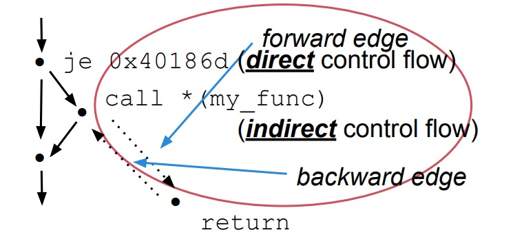
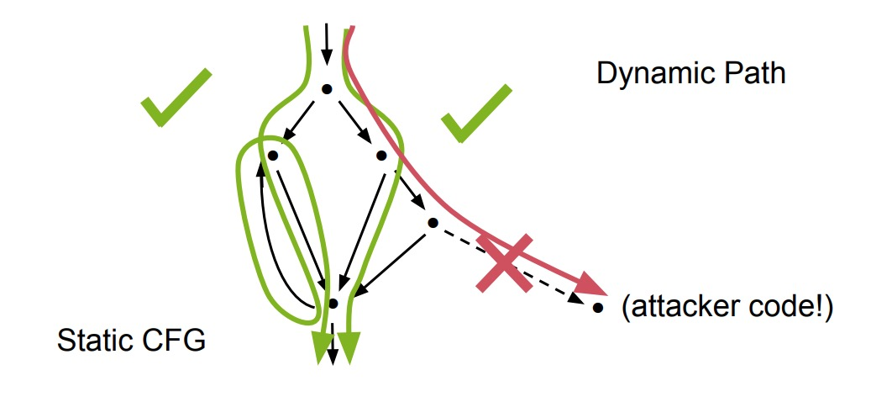
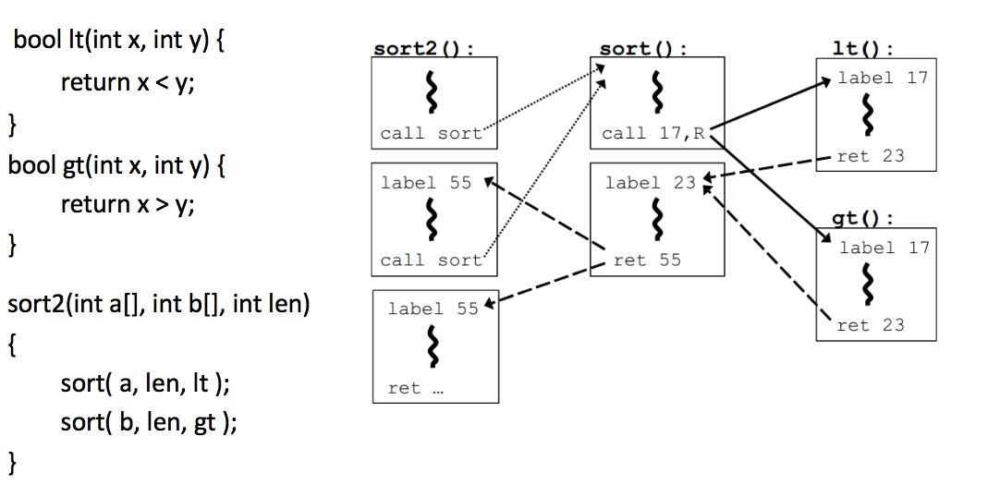
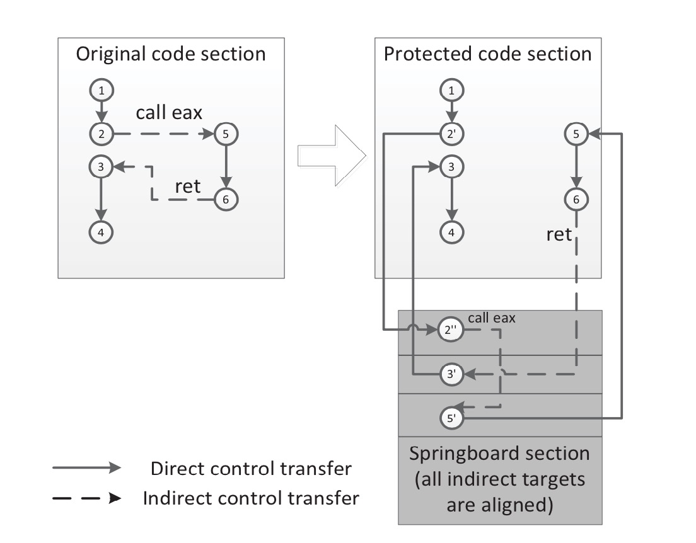
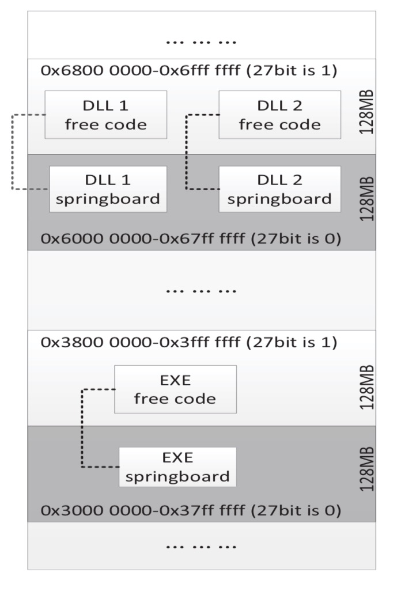
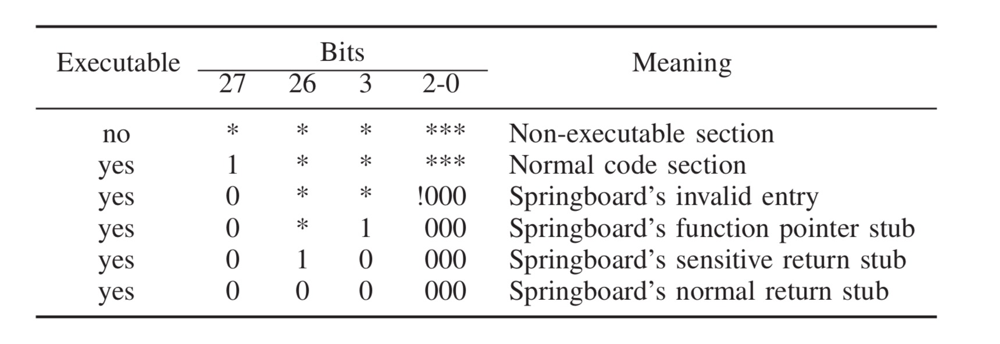
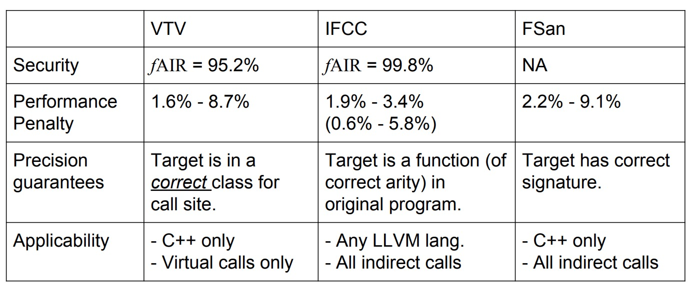

### Control-Flow Integrity                 
---                
#### 0x00. 从跳转指令开始谈起               
在汇编语言中,根据寻址方式的不同可以分为两种跳转指令。一种是间接跳转指令,另一种是直接跳转指令。        
直接跳转指令的示例如下所示:   

> CALL 0x1060000F      

在程序执行到这条语句时,就会将指令寄存器的值替换为0x1060000F。这种在指令中直接给出跳转地址的寻址方式就叫做直接转移。在高级语言中, 像if-else,静态函数调用这种跳转目标往往可以确定的语句就会被转换为直接跳转指令。                  
                     
间接跳转指令则是使用数据寻址方式间接的指出转移地址，比如:               
> JMP EBX            

执行完这条指令之后, 指令寄存器的值就被替换为EBX寄存器的值。它的转换对象为作为回调参数的函数指针等动态决定目标地址的语句。       
                  
以上是通过寻址方式进行的分类, 在CFI中还有一个比较特殊的分类方式, 就是前向和后向转移。        
这个比较容易理解, 将控制权定向到程序中一个新位置的转移方式, 就叫做前向转移, 比如jmp和call指令             
而将控制权返回到先前位置的就叫做后向转移, 最常见的就是ret指令。        
                  
将以上两种分类方式结合起来, 前向转移指令call和jmp根据寻址方式不同, 又可以分为直接jmp, 间接jmp，直接call，间接call四种。而后向转移指令ret没有操作数，它的目标地址计算是通过从栈中弹出的数来决定的。正因为ret指令的特性，引发了一系列针对返回地址的攻击。

  

#### 0x01. CFI发展历史和提出原因         
**由于老师给的参考文献较多,且属于几个不同方向的,因此想用时间线的方式讲清楚CFI的发展历史以及不同CFI机制的原理等等(这里只涉及了文献以及文献中提到的主要技术)**         
      
* 20世纪80年代  出现溢出攻击    
在20世纪80年代,就已经出现了溢出攻击。在1988年的Morris蠕虫利用了Unix上的finger服务的缓冲区溢出漏洞之后,溢出攻击被更多人知晓并研究。     

* 1996年  第一篇具有学术价值的缓冲区溢出论文       
在针对这类漏洞的利用逐渐增多之后。1996年,Aleph One在Phrack杂志上发表了题为“Smashing the Stack for Fun and Profit”的文章,并详细描述了Linux系统中栈的结构和如何利用基于栈的缓冲区溢出。           

* 1998年 StackGuard的出现(StackGuard **第5篇文章**)        
1998年,Cowan,C.Pu等人在USENIX上提出了侦测和防止缓冲区溢出发生的自适应技术,即StackGuard。StackGuard是第一个使用 Canary探测的堆栈保护实现，它于1997年作为GCC的一个扩展发布。     
**StackGuard**的简要介绍:      
StackGuard是一个编译器扩展,用于检测并阻止对堆栈的缓冲区溢出攻击。它有两种工作模式,一种是在函数返回之前检测返回地址的变化(Canary),另一种是完全拒绝写入返回地址来阻止动态修改(MemGuard)。      
**第一种方法**是,在栈中的返回地址旁放置一个"Canary"值,在函数返回之前检测Canary是否一致再跳转。栈结构如下图所示:

  

下面用两段汇编代码说明Canary保护的具体操作,第一段代码是在函数执行前多出的三条语句, %gs:0x14中存储的是一个随机数,在执行前把这个随机数赋给EAX,然后将EAX压入EBP-8的位置。第二段代码是在函数返回前的操作,将该随机数弹栈,并与原来的数异或比较,如果相同才跳转,否则会执行异常。(不过这两段代码是Canary的改进版本SSP的)   

  

  

但是这种方法存在许多问题,因为其假设在Canary不改变的情况下返回地址就不会被改变,也就是攻击者只会线性、顺序的写入数据。但实际上由于函数指针或其他问题都可能导致这个假设不成立,文章中还提出了两种可能的攻击,一种是构造满足对齐要求的数组,使得Canary所在的位为空,这样可以避免覆盖Canary,另一种是模拟Canary,比如猜测和暴力破解的方式。      
**第二种方法**是阻止对函数返回地址的写入,它基于MemGuard,一种允许将内存中的特定字设置为只读,只能用特定的API写入的方法保护重要数据。但它的问题在于,实现的时候MemGuard通常将保护重要数据的整个虚拟内存页设置为只读,在对于其他不受保护的数据进行写入时,它采用模拟写入(开辟一块区域把这些写入存起来,等保护结束后再一并写入)的方式,这种方式造成性能开销非常大,尤其是受保护的还是栈这样写入频繁的区域。于是文章中提出一种优化方法,就是使用调试寄存器(当时的奔腾只要4个)来缓存最近受到保护的return address,当返回直接读取这些寄存器的值,这样就不用将栈顶所在的页设置为只读了。       
经过对上面两种方法的介绍,可以看出基于Canaryd的方法更加简洁、效率更高,而基于MemGuard的方法安全性更好,但开销更大。这篇文章的标题是缓冲区溢出的自适应检测和防御,因此作者还在文章中提出StackGuard运行的基本模型:当通过Canary或MemGuard检测出缓冲区溢出时，则终止该进程。然后通过重新启动的机制自适应选择在安全性和性能中作出权衡,选择采用Canary还是MenGuard机制。        
因为这篇文章已经发表太久了,就不对性能开销做过多介绍了。         
 
* 2001年  ASLR(地址空间布局随机化)的提出       
2001年,ASLR作为Linux内核的一个补丁提出,它是通过对堆、栈、共享库映射等线性区布局的随机化增加攻击者预测目的地址的难度。绕过ASLR的攻击有之前讲过的堆喷射,攻击未启用ASLR的模块等等。      

* 2004年  在Windows XP Service Pack 2上提出了DEP(数据执行保护)     
DEP是Windows实现的数据执行保护,还有其他比Windwos实现更早的系统。DEP的之前出现过很多次,就不再细讲了。而针对DEP的攻击有ROP等利用程序中原有的Gadget进行攻击的方法,之前也都讲过了。        

  

* 2005年  第一次提出CFI机制(CCS论文：Control-Flow-Integrity)       
在DEP\ASLR\Canary这些技术提出以后,可能为了能够彻底杜绝控制流劫持类型的攻击，2005年CCS上发表了一篇名为《Control-Flow Integrity》的文章，正式提出了CFI的概念。     
CFI防御机制的核心思想是限制程序运行中的控制流转移，使其始终处于原有的控制流图所限定的范围内。其主要分为两个阶段,一是通过二进制或者源代码程序分析的控制流图(CFG),获取间接转移指令目标的白名单(我们一开始提到了直接转移和间接转移,直接转移的操作数是在程序运行前就决定且不可更改的,可以由W⊕X机制保护,因此不需要检验,间接转移的操作数是从内存或寄存器中得到的,是有可能被篡改的)，二是运行时检验间接转移指令的目标是否在白名单中。控制流劫持往往会违背原有的控制流图，CFI则使这种行为难以实现。      

  

* 2010年  介绍CFI机制的概况(**第1篇文章** Control-Flow Integrity Principles, Implementations, and Applications)       
原始的CFI机制理论上是对所有的间接转移指令进行检查,确保其只能跳转到它自身的目标集合,但这样的开销过大。因此又提出了对CFI改进的方法,接下来我们详细讲解一段CFI分析的过程。       
首先是对CFG的构建,CFG(Control-Flow Graph)控制流图,其实在第一次报告的时候就有讲过,它是基于静态分析的用图的方式表达程序的执行路径。如下图所示,以分支指令作为边,圆圈则表示普通指令。CFI中的CFG构建与普通CFG比较不同的地方在于,为了降低开销,受检测的边应该越少越好。因此在CFG中只考虑将可能受到攻击的间接call、间接jmp和ret指令作为边。       

  

构建完CFG后就是动态检测过程。左边是一段C语言程序(简单介绍一下程序流程,对应CFG),右边为CFG及代码段内的所有边缘。文章约定如果指向两个目标地址的边拥有相同的源集合的话,那么这两个目标地址就是等价的,等价的目标用同一label表示。在这段程序中,lt()与gt()的源调用地址相同,因此被标记为同一label 17。在实际执行阶段,由于sort()类似于qsort()是一个静态函数,所以sort2()的call指令属于直接调用,不需要检测。而sort()对于lt和gt的调用属于间接调用,需要检查目标地址的label是否与CFG中设定的一样。比如在图中, call 17,R, 17为目标label,R为保存函数指针的寄存器,对比两者以确保没有被攻击者更改。在lt或gt执行完成后,对ret指令进行同样的检查,sort()的返回也是如此。       

  

以上就是一种粗粒度的CFI,它将多个不同的目标地址合在一起减少需要检测目标地址的数量。可以看出为了降低性能开销,是以牺牲安全性为前提的。

* 2013年  CCFIR的提出(**第2篇文章**)         
在CFI被提出后过了很长时间都没有被广泛应用到实际生产中去,主要原因还是插桩引起的开销过大。因此在2013年又提出了CCFIR,在同一年提出的还有binCFI,ModularCFI等等,但CCFIR是非常典型的一个实现。与上面我们所讲的机制将目标集合按照指向边的源集合是否相同来划分不一样,CCFIR更加简洁的将目标集合划分为了三类。所有的间接call和jmp指令的目标被归为一类,称为函数指针;ret指令的目标被归为两类,一类是敏感库函数(比如libc中的额system函数),另一类是普通函数。下面我们以下图中的例子来说明CCFIR的工作原理:     
左边是原始的控制流,右边是CCFIR机制下的控制流。CCFIR提出了通过Springboard段(下方灰色部分)存放有效间接转移目标的地址,在这段控制流中,5和3节点节点分别是call eax指令和ret指令这两个间接转移指令的目标地址,因此都会被存在Springboard段中。在程序执行到节点2'时,会检测接下来的跳转地址是否在Springboard段中,是则跳转,否则出错,从节点6跳转到3也是一样。

  

Springboard段的内存布局如图所示,通过将某一位设置成0/1来区分普通段和Springboard段。这样在跳转检测时检查某一个目标是否在Springboard段,只要检测某一位的值就可以了。      

      

再进一步扩展,由于目标地址主要被分为三类,那么这三类又可以通过几位的不同来区分,如下图。第27bit为0则表示是Springboard段,第3位为1则属于函数指针,为0属于ret地址,并通过26位区分是敏感函数地址还是普通函数地址。      

       

CCFIR的主要贡献在于它降低了CFI机制的开销,希望能将CFI投入实际使用中去。

* 2014年  Google 间接函数调用检查(**第6篇文章**)         
随着对堆栈的保护越来越完善,出现了很多基于非堆栈的前向转移攻击,尤其是call指令。例如利用UAF漏洞覆盖vtable指针等等。这篇文章的主要贡献不是提出了什么新的机制,而是将CFI真正用到了生产编译器中,仅针对于前向转移。以下是主要工作:       
Vtable Verification (VTV), in GCC 4.9,主要是对vtable调用进行检测,VTV在每个调用点验证用于虚拟调用的vtable指针的有效性。      
Indirect Function Call Checker (IFCC), in LLVM。它通过为间接调用目标生成跳转表并在间接调用点添加代码来转换函数指针来保护间接调用，从而确保它们指向跳转表条目。任何未指向相应表的函数指针都被视为CFI违规。
Indirect Function Call Sanitizer (FSan), in LLVM是一个可选的间接调用检查器。       

  

* 2014-2015年 其他CFI        
基于前述方案的缺陷，又有人提出了上下文敏感的 CFI（Context sensitive CFI）机制。它依赖于上下文敏感的静态分析，将 CFI 不变量和 CFG 中的控制流路径联系到一起，运行时在执行路径上强制执行这些不变量。2014 年的论文《Complete Control-Flow Integrity for Commodity Operating System Kernels》在操作系统的内核上实现了 CFI，使之免受控制流劫持等攻击，这个系统被称为 KCoFI。他们在基于标签的控制流间接转移保护的基础上，加入一个运行时监控的软件层，负责保护一些关键的操作系统数据结构和监控操作系统进行的所有底层状态操作。（这个系统加入了实时监控系统底层状态操作，如果是高 IO 的情况下，性能表现比较差) 2015 年论文：《CCFI: Cryptographically Enforced Control Flow Integrity》, 提出了一种通过对代码指针加密的方法来增强 CFI 的保护。这个观点出发点是好的，但是在大部分硬件效率跟不上的情况下，很难在现实中运用。

* 针对前面几种粗粒度CFI提出的攻击方式    
当然,攻防是相对应的,前面一直在说粗粒度的CFI不够安全,2014 年的论文《Out of Control: Overcoming Control-Flow Integrity》中就针对粗粒度CFI提到了一种攻击手段。他们利用了两种特殊的 Gadget：entry point(EP) gadget 和 call site(CS) gadget，来绕开粗粒度 CFI 机制的防御。     
2015 年的论文《Losing Control: On the Effectiveness of Control-Flow Integrity under Stack Attacks》,也提到了对 CFI 保护下的栈的攻击手段。在此论文发表前，通过影子栈（Shadow Stack）来检测函数返回目标，再加上 DEP 和 ASLR 的保护，栈应该会变得非常安全，但是事实并非如此。这篇论文中提到了三种攻击手段，一是利用堆上的漏洞来破坏栈上的 calleesaved 寄 存 器 保 存 区 域， 使得calleesaved 寄存器被劫持；二是利用用户空间和内核之间进行上下文切换的问题，来劫持 sysenter 指令，使控制跳转到攻击者想跳转的位置；       
         
* 2015年  通过Control-Flow Bending绕过CFI(**第4篇文章**)       
http://www.cnblogs.com/lzhdcyy/p/6409723.html

* 2017年  对现有CFI机制的安全性和开销作出系统的评价(**第3篇文章**)           
对不同CFI机制的比较我们在下一节中详细介绍。
       

#### 0x02. 不同CFI的比较(性能、安全性)         
1. 对性能的计算     
目前大多数的CFI机制对性能计算都是基于
定性安全保证 => 定量安全计算      
性能开销 => 部分用文献中的结果, 最新版本自行测试      
以上测试基于SPEC CPU2006基准测试程序

#### 0x03. CFI的应用范围、发展前景         
* Clang: https://en.wikipedia.org/wiki/Clang (一个编译器前端，用LLVM编译器架构作为其后端)         
* Microsoft's Control Flow Guard：https://en.wikipedia.org/wiki/Control-flow_integrity       
* Return Flow Guard: https://xlab.tencent.com/en/2016/11/02/return-flow-guard/ (腾讯玄武实验室)      
* Google's Indirect Function-Call Checks (gcc 和 llvm)      
* Reuse Attack Protector： https://grsecurity.net/rap_faq.php (RAP)       

这些都是CFI的一些现有应用,因为时间关系没办法一一介绍,但可以确定的是它们都在性能和安全性上有所取舍。       

#### 0x04. 个人想法              
+ 粗粒度的CFI安全性不够       
+ 细粒度的CFI性能开销太大      
+ 出现很多CFI无法防护的攻击——Data oriented programming(上一节课讲过的DOP)        
以上对于CFI的介绍主要还是策略方面,因为随着软硬件的发展,对于不同的硬件、操作系统、编译器甚至语言都会有不同的实现方式,而且没有哪一种可以说是完美无缺的。但是在git中我们给出了很多CFI机制的文献和应用场景,欢迎大家探讨交流。

### 参考文献
---
+ 吴世忠郭涛董国伟张普含， 软件漏洞分析技术 ，科学出版社，2014. 
+ Bryant &O’Hallaron, Computer Systems: A Programmer’s Perspective (2 ed.) , Pearson Education, 2011.中译本: 深入理解计算机系统，机械工业出版社, 2011. 
+ David Brumley and Vyas Sekar, Introduction to Computer Security (18487/15487), 2015      
+ **1**.Control-Flow Integrity Principles, Implementations, and Applications[J].ACM transactions on information and system security,2010,13(1):p.4:1-. (B类 TISSEC)     
+ **2**.Zhang, Chao,Wei, Tao,Chen, Zhaofeng, et al.Practical Control Flow Integrity and Randomization for Binary Executables[C].//2013 IEEE symposium on security and privacy: SP 2013, Berkeley, California, USA, 19-22 May 2013.%%%,2013:559-573.(A类 S&P)         
+ **3**.Burow N, Carr S A, Nash J, et al. Control-flow integrity: Precision, security, and performance[J]. ACM Computing Surveys (CSUR), 2017, 50(1): 16.(1区 CSUR)        
+ **4**.Carlini N, Barresi A, Payer M, et al. Control-Flow Bending: On the Effectiveness of Control-Flow Integrity[C]//USENIX Security Symposium. 2015: 161-176.（A类 USENIX）       
+ **5**.Cowan C, Pu C, Maier D, et al. Stackguard: Automatic adaptive detection and prevention of buffer-overflow attacks[C]//USENIX Security Symposium. 1998, 98: 63-78.(A类 USENIX)        
+ **6**.Tice C, Roeder T, Collingbourne P, et al. Enforcing Forward-Edge Control-Flow Integrity in GCC & LLVM[C]//USENIX Security Symposium. 2014: 941-955.(A类 USENIX)
